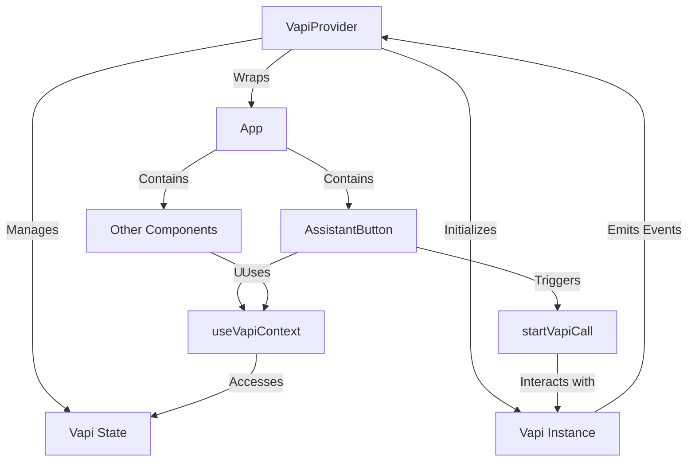

```mermaid
graph TD
    A[VapiProvider] -->|Wraps| B[App]
    B -->|Contains| C[AssistantButton]
    B -->|Contains| D[Other Components]
    A -->|Manages| E[Vapi State]
    A -->|Initializes| F[Vapi Instance]
    F -->|Emits Events| A
    C -->|Uses| G[useVapiContext]
    D -->|Uses| G
    G -->|Accesses| E
    C -->|Triggers| H[startVapiCall]
    H -->|Interacts with| F
```
